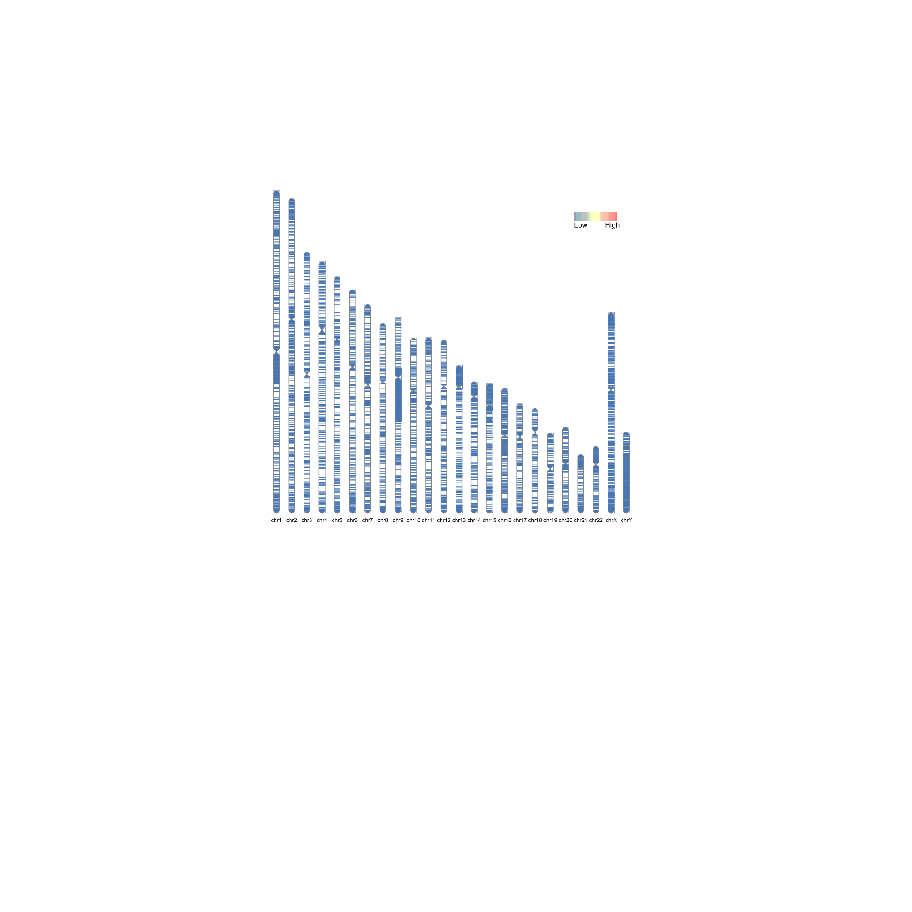
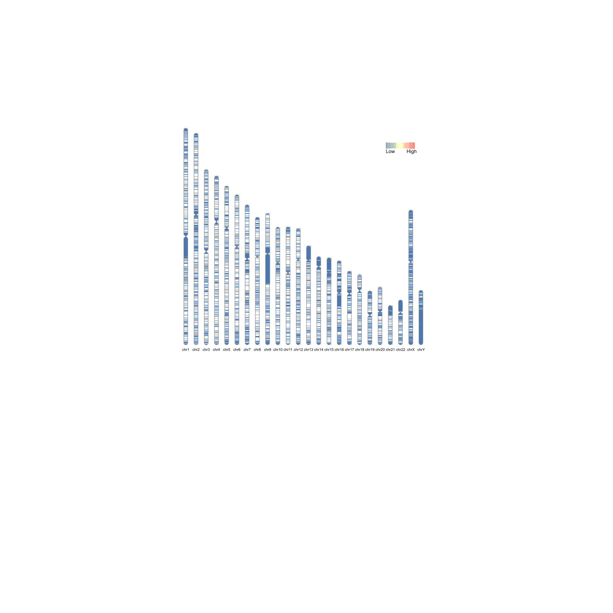
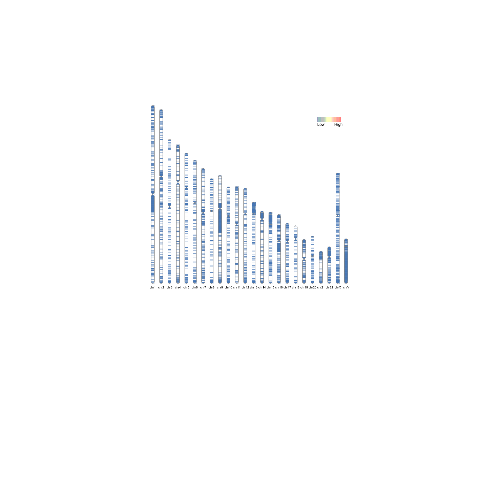
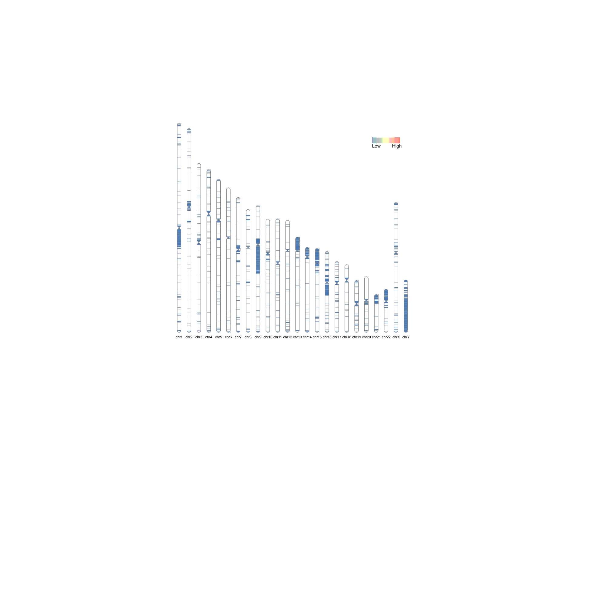
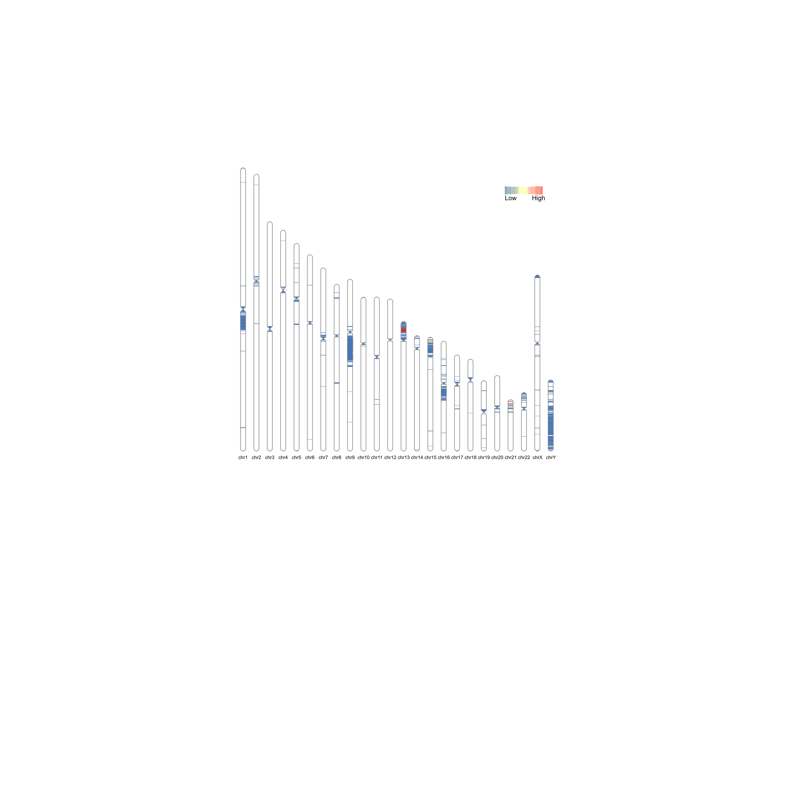
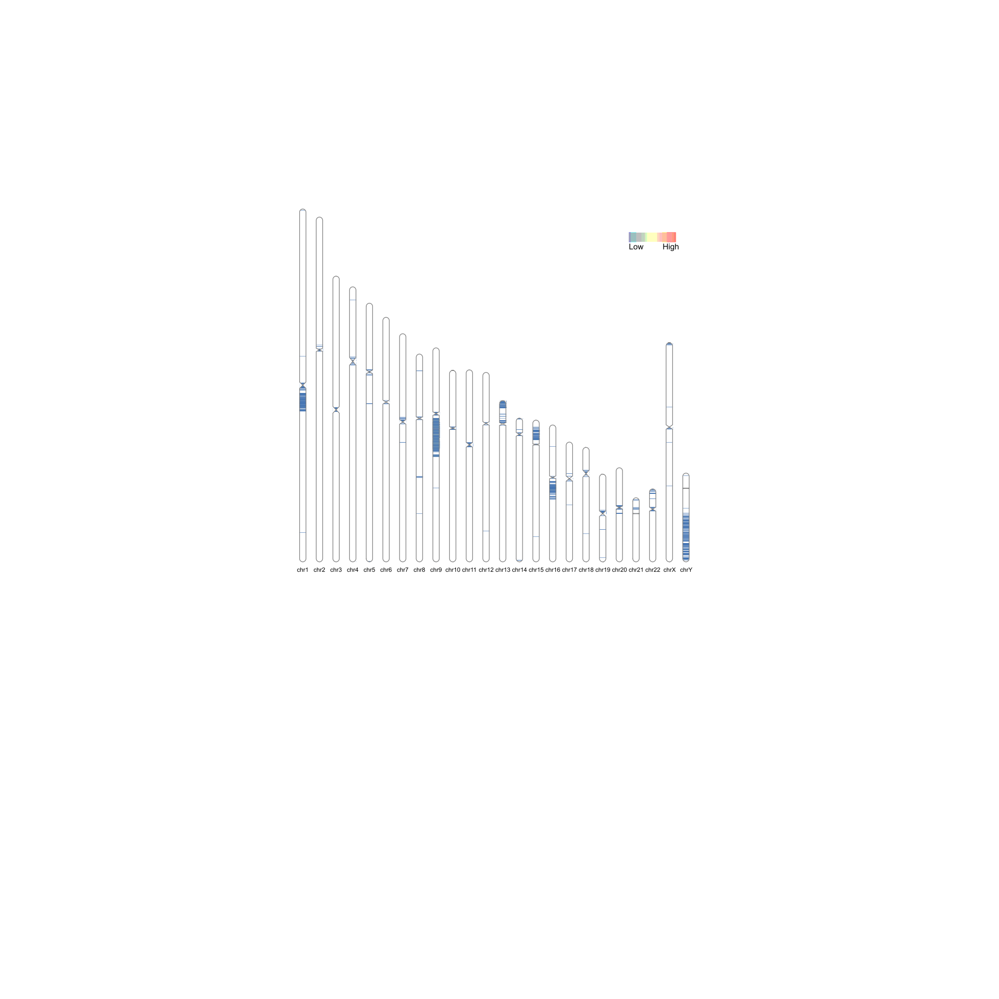
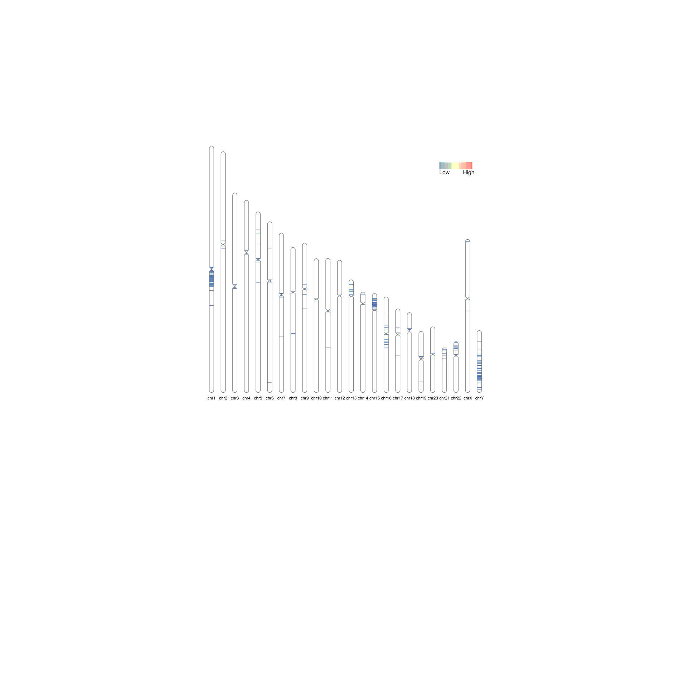
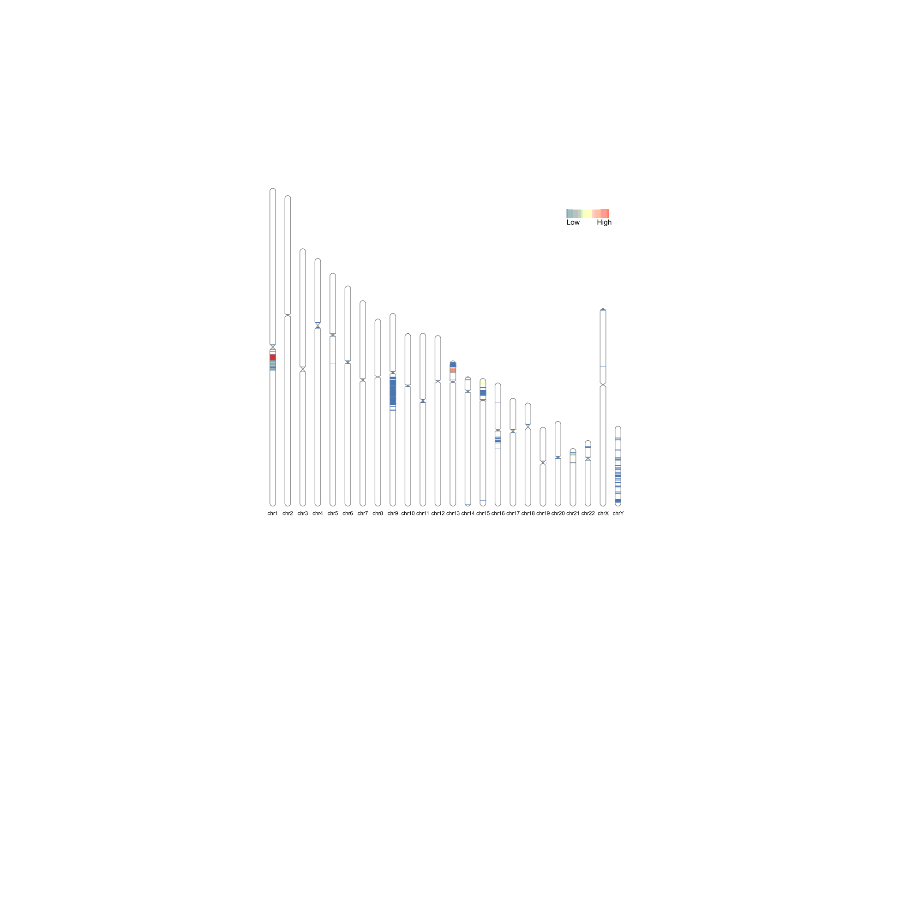
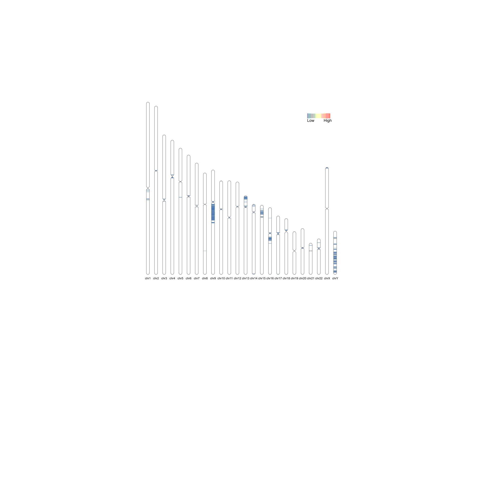
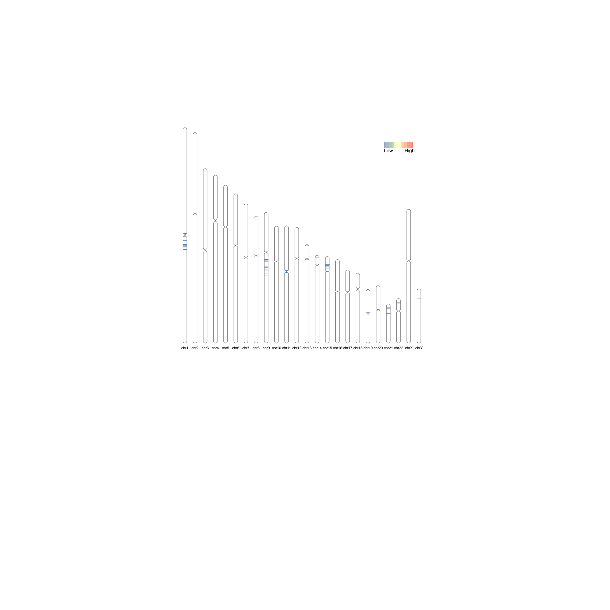

```{r setup, include=FALSE}
knitr::opts_chunk$set(echo = TRUE)
library(reshape2)
library(ggplot2)
library(RIdeogram)
```


# Load Illumina100 Data

```{r}
illumina100.inter = read.table("../data/Illumina100_CHM13/comparisonOfDarkRegions/IntersectPrimarySupp.vs.PrimaryOnly.bed", header=F, sep="\t", stringsAsFactors = F)
illumina100.UniquePrimaryOnly = read.table("../data/Illumina100_CHM13/comparisonOfDarkRegions/Unique2PrimaryOnly.bed", header=F, sep="\t", stringsAsFactors = F)
illumina100.UniquePrimarySupp = read.table("../data/Illumina100_CHM13/comparisonOfDarkRegions/Unique2PrimarySupp.bed", header=F, sep="\t", stringsAsFactors = F)

```

```{r}
chm13_karyotype = read.table("../referenceSizes/chm13v2.0_cytobands_allchrs.bed", header=T, sep="\t", stringsAsFactors = F)
```

## Intersection

```{r}
illumina100.inter$Value = illumina100.inter$V3-illumina100.inter$V2
colnames(illumina100.inter) = c("Chr", "Start", "End", "Value")

ideogram(chm13_karyotype, output = "chromosome.svg", overlaid = illumina100.inter)
convertSVG(svg = "chromosome.svg", file = "Illumina100.IntersectPrimaryOnlyAndPrimarySupp.png", device = "png", width = 6.5, height = 6.5)

```



## Primary Only

```{r}
illumina100.UniquePrimaryOnly$Value = illumina100.UniquePrimaryOnly$V3-illumina100.UniquePrimaryOnly$V2
colnames(illumina100.UniquePrimaryOnly) = c("Chr", "Start", "End", "Value")

ideogram(chm13_karyotype, output = "chromosome.svg", overlaid = illumina100.UniquePrimaryOnly)
convertSVG(svg = "chromosome.svg", file = "Illumina100.Unique2PrimaryOnly.png", device = "png", width = 6.5, height = 6.5)
```


## Primary+Supp

```{r}

illumina100.UniquePrimarySupp$Value = illumina100.UniquePrimarySupp$V3-illumina100.UniquePrimarySupp$V2
colnames(illumina100.UniquePrimarySupp) = c("Chr", "Start", "End", "Value")

ideogram(chm13_karyotype, output = "chromosome.svg", overlaid = illumina100.UniquePrimarySupp)
convertSVG(svg = "chromosome.svg", file = "Illumina100.Unique2PrimarySupp.png", device = "png", width = 6.5, height = 6.5)
```




# Load Illumina250 Data

```{r}
illumina250.inter = read.table("../data/Illumina250_CHM13/comparisonOfDarkRegions/IntersectPrimarySupp.vs.PrimaryOnly.bed", header=F, sep="\t", stringsAsFactors = F)
illumina250.UniquePrimaryOnly = read.table("../data/Illumina250_CHM13/comparisonOfDarkRegions/Unique2PrimaryOnly.bed", header=F, sep="\t", stringsAsFactors = F)
illumina250.UniquePrimarySupp = read.table("../data/Illumina250_CHM13/comparisonOfDarkRegions/Unique2PrimarySupp.bed", header=F, sep="\t", stringsAsFactors = F)

```

## Intersection

```{r}
illumina250.inter$Value = illumina250.inter$V3-illumina250.inter$V2
colnames(illumina250.inter) = c("Chr", "Start", "End", "Value")

ideogram(chm13_karyotype, output = "chromosome.svg", overlaid = illumina250.inter)
convertSVG(svg = "chromosome.svg", file = "Illumina250.IntersectPrimaryOnlyAndPrimarySupp.png", device = "png", width = 6.5, height = 6.5)

```



## Primary Only

```{r}
illumina250.UniquePrimaryOnly$Value = illumina250.UniquePrimaryOnly$V3-illumina250.UniquePrimaryOnly$V2
colnames(illumina250.UniquePrimaryOnly) = c("Chr", "Start", "End", "Value")

ideogram(chm13_karyotype, output = "chromosome.svg", overlaid = illumina250.UniquePrimaryOnly)
convertSVG(svg = "chromosome.svg", file = "Illumina250.Unique2PrimaryOnly.png", device = "png", width = 6.5, height = 6.5)
```


## Primary+Supp

```{r}

illumina250.UniquePrimarySupp$Value = illumina250.UniquePrimarySupp$V3-illumina250.UniquePrimarySupp$V2
colnames(illumina250.UniquePrimarySupp) = c("Chr", "Start", "End", "Value")

ideogram(chm13_karyotype, output = "chromosome.svg", overlaid = illumina250.UniquePrimarySupp)
convertSVG(svg = "chromosome.svg", file = "Illumina250.Unique2PrimarySupp.png", device = "png", width = 6.5, height = 6.5)
```



# Load PacBio Data

```{r}
pacbio.inter = read.table("../data/PacBio_CHM13/comparisonOfDarkRegions/IntersectPrimarySupp.vs.PrimaryOnly.bed", header=F, sep="\t", stringsAsFactors = F)
pacbio.UniquePrimaryOnly = read.table("../data/PacBio_CHM13/comparisonOfDarkRegions/Unique2PrimaryOnly.bed", header=F, sep="\t", stringsAsFactors = F)
pacbio.UniquePrimarySupp = read.table("../data/PacBio_CHM13/comparisonOfDarkRegions/Unique2PrimarySupp.bed", header=F, sep="\t", stringsAsFactors = F)

```

## Intersection

```{r}
pacbio.inter$Value = pacbio.inter$V3-pacbio.inter$V2
colnames(pacbio.inter) = c("Chr", "Start", "End", "Value")

ideogram(chm13_karyotype, output = "chromosome.svg", overlaid = pacbio.inter)
convertSVG(svg = "chromosome.svg", file = "PacBio.IntersectPrimaryOnlyAndPrimarySupp.png", device = "png", width = 6.5, height = 6.5)

```



## Primary Only

```{r}
pacbio.UniquePrimaryOnly$Value = pacbio.UniquePrimaryOnly$V3-pacbio.UniquePrimaryOnly$V2
colnames(pacbio.UniquePrimaryOnly) = c("Chr", "Start", "End", "Value")

ideogram(chm13_karyotype, output = "chromosome.svg", overlaid = pacbio.UniquePrimaryOnly)
convertSVG(svg = "chromosome.svg", file = "PacBio.Unique2PrimaryOnly.png", device = "png", width = 6.5, height = 6.5)
```




## Primary+Supp

```{r}

pacbio.UniquePrimarySupp$Value = pacbio.UniquePrimarySupp$V3-pacbio.UniquePrimarySupp$V2
colnames(pacbio.UniquePrimarySupp) = c("Chr", "Start", "End", "Value")

ideogram(chm13_karyotype, output = "chromosome.svg", overlaid = pacbio.UniquePrimarySupp)
convertSVG(svg = "chromosome.svg", file = "PacBio.Unique2PrimarySupp.png", device = "png", width = 6.5, height = 6.5)
```




# Load ONT Data

```{r}
ont.inter = read.table("../data/ONT_CHM13/comparisonOfDarkRegions/IntersectPrimarySupp.vs.PrimaryOnly.bed", header=F, sep="\t", stringsAsFactors = F)
ont.UniquePrimaryOnly = read.table("../data/ONT_CHM13/comparisonOfDarkRegions/Unique2PrimaryOnly.bed", header=F, sep="\t", stringsAsFactors = F)
ont.UniquePrimarySupp = read.table("../data/ONT_CHM13/comparisonOfDarkRegions/Unique2PrimarySupp.bed", header=F, sep="\t", stringsAsFactors = F)

```

## Intersection

```{r}
ont.inter$Value = ont.inter$V3-ont.inter$V2
colnames(ont.inter) = c("Chr", "Start", "End", "Value")

ideogram(chm13_karyotype, output = "chromosome.svg", overlaid = ont.inter)
convertSVG(svg = "chromosome.svg", file = "ONT.IntersectPrimaryOnlyAndPrimarySupp.png", device = "png", width = 6.5, height = 6.5)

```



## Primary Only

```{r}
ont.UniquePrimaryOnly$Value = ont.UniquePrimaryOnly$V3-ont.UniquePrimaryOnly$V2
colnames(ont.UniquePrimaryOnly) = c("Chr", "Start", "End", "Value")

ideogram(chm13_karyotype, output = "chromosome.svg", overlaid = ont.UniquePrimaryOnly)
convertSVG(svg = "chromosome.svg", file = "ONT.Unique2PrimaryOnly.png", device = "png", width = 6.5, height = 6.5)
```




## Primary+Supp

```{r}

ont.UniquePrimarySupp$Value = ont.UniquePrimarySupp$V3-ont.UniquePrimarySupp$V2
colnames(ont.UniquePrimarySupp) = c("Chr", "Start", "End", "Value")

ideogram(chm13_karyotype, output = "chromosome.svg", overlaid = ont.UniquePrimarySupp)
convertSVG(svg = "chromosome.svg", file = "ONT.Unique2PrimarySupp.png", device = "png", width = 6.5, height = 6.5)
```


